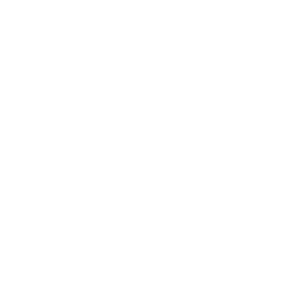
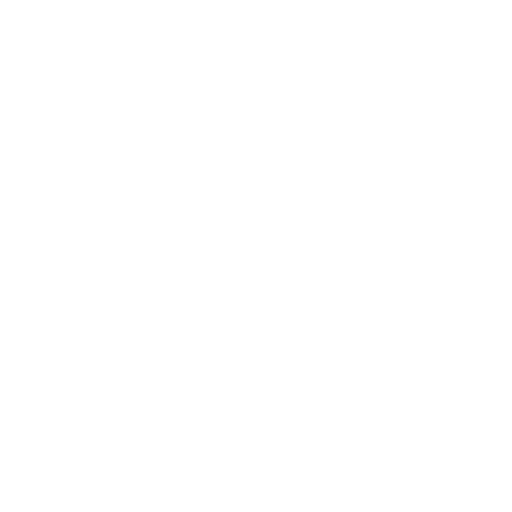

<!-- HEADER BANNER WITH BLUR GRADIENT & FLANKING X-WINGS -->
<table border="0" cellpadding="0" cellspacing="0" width="100%">
  <tr align="center">
    <td width="10%" valign="middle">
      
    </td>
    <td width="80%" valign="middle">
      <!-- Integrated your exact blur gradient setup with a Cyan stroke outline -->
      
    </td>
    <td width="10%" valign="middle">
      
    </td>
  </tr>
</table>

 

<!-- CENTERED COMM-LINK TERMINAL -->

  <a href="mailto:ayushgouda.005@gmail.com">⚡ INITIATE CONTACT</a>
  &nbsp;&nbsp;&bull;&nbsp;&nbsp; 
  <a href="https://linkedin.com">LINKEDIN PROFILE</a>

 

<!-- SYSTEM OVERVIEW SECTION (ANIMATED CYLINDER) -->

  

<strong>Computer Science Undergraduate @ RVITM</strong>

  Specializing in <b>Scientific Machine Learning (SciML)</b>, <b>Physics-Informed Neural Networks (PINNs)</b>, and high-fidelity signal processing. I design physics-constrained computational architectures for multiphysics modeling and inverse problem diagnostics.

  Experienced in executing large-scale ML research pipelines and architecting event-driven MLOps infrastructure to automate the build-release lifecycle of deep learning models.

 

<!-- LANGUAGE TELEMETRY SECTION (ANIMATED CYLINDER) -->

  

  

 

<!-- TECHNICAL MATRIX SECTION (ANIMATED CYLINDER) -->

  

<table border="0" cellpadding="10" cellspacing="0" width="100%">
  <tr align="center">
    <td width="33%" valign="top" style="border-right: 1px solid #0B1F3F;">
        
      
      
      
    </td>
    <td width="33%" valign="top" style="border-right: 1px solid #0B1F3F;">
        
      
      
      
    </td>
    <td width="34%" valign="top">
        
      
      
      
    </td>
  </tr>
</table>

  

<!-- FOOTER GLOW DECORATION -->

  

